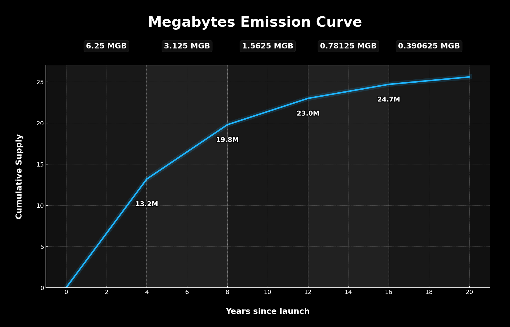

<p align="center">
  
</p>

---

## Economic Commitment (Block #1)

Megabytes (MGB) uses a fully transparent and immutable economic model.

The entire economic specification is **cryptographically committed on-chain in block #1**, ensuring that the model cannot be altered or misrepresented without a deliberate hard fork.

### **Document**
`ECONOMICS_SPEC.md`

### **SHA-256**
`2AA75B318A97BB706A9325530406633405A96539FA58F6EE93A520EA3244813B`

### **Commitment Type**
`OP_RETURN` output in the **coinbase transaction of block #1**

### **Verification Instructions**

Anyone can independently verify the authenticity of the economic model:

```bash
sha256sum ECONOMICS_SPEC.md
# Compare the resulting hash with the OP_RETURN data in block 1
```

---
